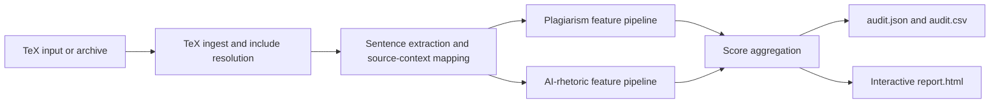

# paper-forensics

`paper-forensics` is a TeX-first review application for academic document forensics. It is built for sentence-level manuscript review, not for making definitive claims about plagiarism, AI authorship, or misconduct.

The system produces two inspectable heuristic signals:

- `plagiarism_risk_score`: estimated overlap risk against a local literature corpus
- `ai_rhetoric_risk_score`: estimated risk from formulaic, boilerplate, or style-pattern signals

## At A Glance

This repository is an applied ML/NLP engineering project focused on explainable manuscript review, not a black-box classifier.

- **Problem**: help reviewers inspect sentence-level overlap and AI-style rhetoric signals in TeX manuscripts.
- **Approach**: deterministic preprocessing + interpretable heuristic scoring + evidence-first review UX.
- **Output**: auditable JSON/CSV artifacts and an interactive HTML report for human-in-the-loop decisions.
- **Boundary**: explicitly non-forensic and non-probabilistic; all scores are review aids.

## Architecture



## Review Experience

The repo now ships two reviewer-facing surfaces built on the same payload contract:

- `paper-forensics audit ...` writes `audit.json`, `audit.csv`, and a polished single-file `report.html`
- `paper-forensics app` launches a local upload/analyze/review application for `.tex` files and TeX project archives

The review UI is designed for research integrity teams, journal editors, compliance analysts, and manuscript reviewers:

- three-pane workstation layout
- evidence-first sentence inspector
- restrained overlap and AI-style highlighting
- keyboard-friendly navigation for long papers
- paragraph and sentence review modes
- clean-text and raw-TeX context toggles
- section outline, suspicious span navigator, and reviewer filters

## Important Caveat

All scores in this project are normalized heuristic outputs in `[0,1]`. They are review aids only. They are not calibrated probabilities and should not be treated as definitive evidence of authorship, plagiarism, or misconduct.

## Quick Start

```bash
python -m pip install -e .[dev]
paper-forensics audit examples/sample_tex_project/main.tex --corpus examples/corpus --output outputs/sample_run
```

Open [outputs/sample_run/report.html](outputs/sample_run/report.html) in a browser.

## Local App Mode

If you do not want to type terminal commands, use the double-click launcher:

1. In Windows Explorer, open this repo folder.
2. Double-click [Open Paper Forensics.cmd](<Open Paper Forensics.cmd>).
3. A small launcher window appears and your browser opens automatically.
4. In the browser app, click `Choose File`.
5. Select either:
   - a single `.tex` file
   - a TeX project archive: `.zip`, `.tar`, `.tar.gz`, `.tgz`
6. Click `Analyze`.
7. Review the manuscript in the three-pane workspace.

Keep the small launcher window open while you review. Click `Stop App` there when you are done.

If you prefer the command line, you can still launch the local review application with:

```bash
paper-forensics app --corpus examples/corpus --output-root outputs/app_runs
```

Then open `http://127.0.0.1:8765`.

The app supports:

- uploading a single `.tex` file
- uploading a TeX project archive: `.zip`, `.tar`, `.tar.gz`, `.tgz`
- local analysis with the existing sentence-level pipeline
- download links for generated HTML, JSON, and CSV artifacts

## CLI

Audit a manuscript and write artifacts:

```bash
paper-forensics audit path/to/main.tex --corpus path/to/literature --output out/
```

Launch the local workstation:

```bash
paper-forensics app --corpus path/to/literature --output-root outputs/app_runs --port 8765
```

### Useful Flags

- `--corpus PATH`: local literature directory used for overlap matching
- `--max-matches N`: number of source matches preserved per sentence
- `--min-sentence-chars N`: drop very short sentence fragments
- `app --output-root PATH`: where local app runs write their artifacts
- `app --host HOST` and `app --port PORT`: bind the local review server

## What The Pipeline Produces

For each sentence, `paper-forensics` extracts and scores:

- section and subsection location
- paragraph and sentence identifiers
- cleaned prose text
- inlined TeX source context and stable source-context spans
- plagiarism evidence with source matches and overlap phrases
- AI-style evidence with phrase triggers and feature breakdowns

Artifacts written per run:

- `audit.json`
- `audit.csv`
- `report.html`

## Professional Review Workflow

The intended workflow is:

1. Upload a `.tex` file or TeX project archive.
2. Click `Analyze`.
3. Wait for the staged local progress view.
4. Review the manuscript in the center pane in document order.
5. Use the left pane for thresholds, section filters, suspicious spans, and quick jumps.
6. Use the right inspector to evaluate sentence-level evidence before drawing any conclusion.

Keyboard support includes:

- `↑` / `↓` to move between visible sentences
- `Shift + ↑` / `Shift + ↓` to jump between flagged sentences
- `Alt + ↑` / `Alt + ↓` to jump between suspicious spans

## Filters and Views

The review workspace supports:

- plagiarism threshold
- AI-style threshold
- flagged-only review
- only sentences with external matches
- only sentences with style-pattern triggers
- section filter
- free-text search
- sentence view or paragraph view
- clean text or raw TeX context
- comfortable or compact density
- document order or risk-based sorting

## Sample Artifacts

Sample outputs are checked in here:

- [Sample report](outputs/sample_run/report.html)
- [Sample audit JSON](outputs/sample_run/audit.json)
- [Sample audit CSV](outputs/sample_run/audit.csv)

I attempted to generate committed screenshots for the updated workspace in this environment, but the available headless browser setup could not write screenshots reliably under the current sandbox. The linked sample report above is the authoritative visual artifact.

## Current Modeling Boundary

The current release intentionally stays within a defensible offline scope:

- TeX project loading with `\input{}` and `\include{}`
- section-aware cleaning and sentence extraction
- local-corpus overlap evidence using TF-IDF-style vectors, lexical overlap, and rare phrase overlap
- AI-style scoring from curated phrase rules, semantic thinness heuristics, and local style shift
- professional static review report and local app mode

Not included:

- internet-wide retrieval
- calibrated probability estimates
- a true authorship classifier
- PDF or DOCX ingestion

## Evaluation Snapshot

The checked-in sample run (`outputs/sample_run/audit.json`) provides a reproducible sanity check of pipeline behavior.

- sentence count: `8`
- mean plagiarism risk: `0.4548`
- mean AI-rhetoric risk: `0.2544`
- max plagiarism risk: `0.9250`
- max AI-rhetoric risk: `0.5051`
- sentences with plagiarism risk `>= 0.6`: `2`
- sentences with AI-rhetoric risk `>= 0.6`: `0`

These are not benchmark claims; they are transparency-oriented diagnostics for this sample manuscript.

## Known Failure Modes

- **Topic overlap vs true plagiarism**: high lexical or phrase overlap can reflect legitimate topical similarity.
- **Template-heavy prose**: formulaic academic writing may trigger AI-rhetoric rules even when human-authored.
- **Domain/style shift**: phrase lexicons and heuristics may underperform on niche domains or unusual writing styles.
- **Input scope constraints**: only TeX-focused ingestion is supported in this release.

## Repo Layout

```text
src/paper_forensics/
  app_server.py
  cli.py
  config.py
  audit.py
  ingest/
  nlp/
  plagiarism/
  ai_rhetoric/
  scoring/
  report/
examples/
  sample_tex_project/
  corpus/
outputs/
tests/
```

## Development

Run the test suite:

```bash
pytest
```

Run tests with coverage:

```bash
pytest --cov=paper_forensics --cov-report=term-missing
```

## Security Notes

- The local review server binds to `127.0.0.1` (localhost) only by default. Passing `--host 0.0.0.0` or any non-localhost address will print a console warning; do not expose the server on untrusted networks.
- File uploads are rejected above 50 MB before the body is read.
- Archive extraction uses path-traversal checks; members with `../` or absolute paths are rejected.
- All scores are heuristic; this tool is a review aid, not a forensic instrument.

## License

MIT — see [LICENSE](LICENSE).

## Changelog

See [CHANGELOG.md](CHANGELOG.md).

## Design Principles

- TeX extraction correctness before fancy modeling
- inspectable evidence over opaque scores
- restrained and credible reviewer UX over flashy visualization
- offline-first workflow
- modular interfaces so retrievers, classifiers, and calibrators can improve later
